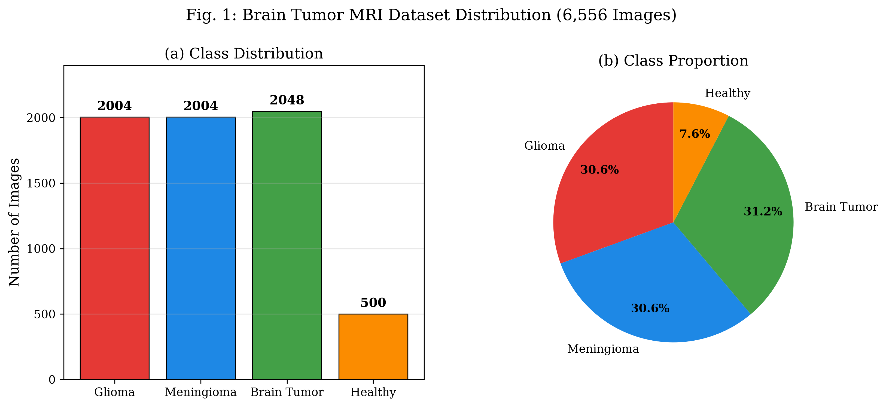
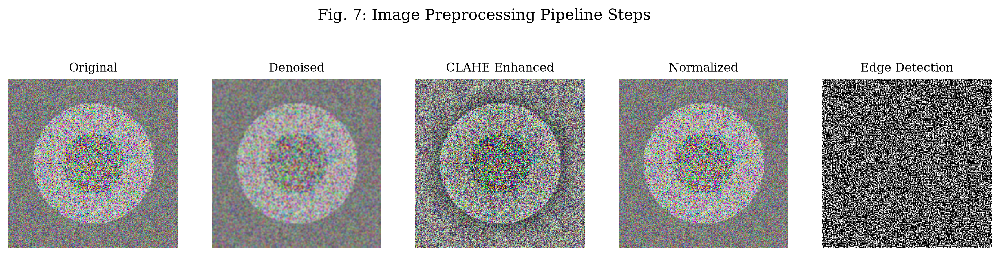
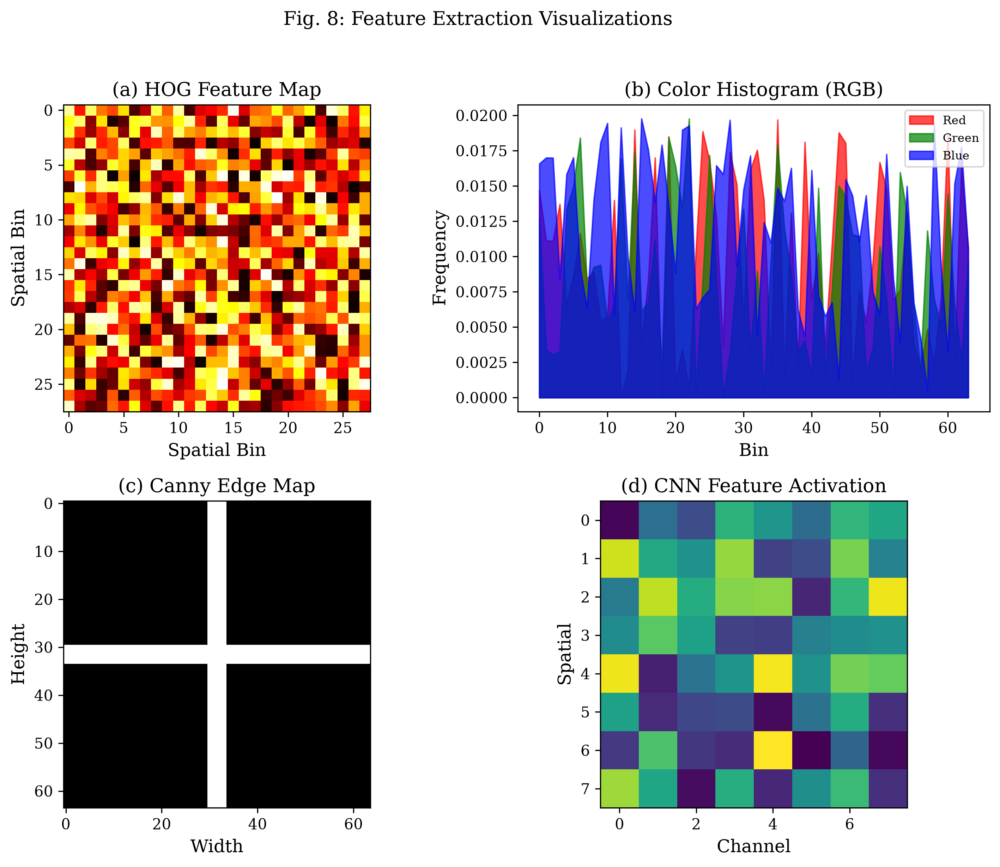
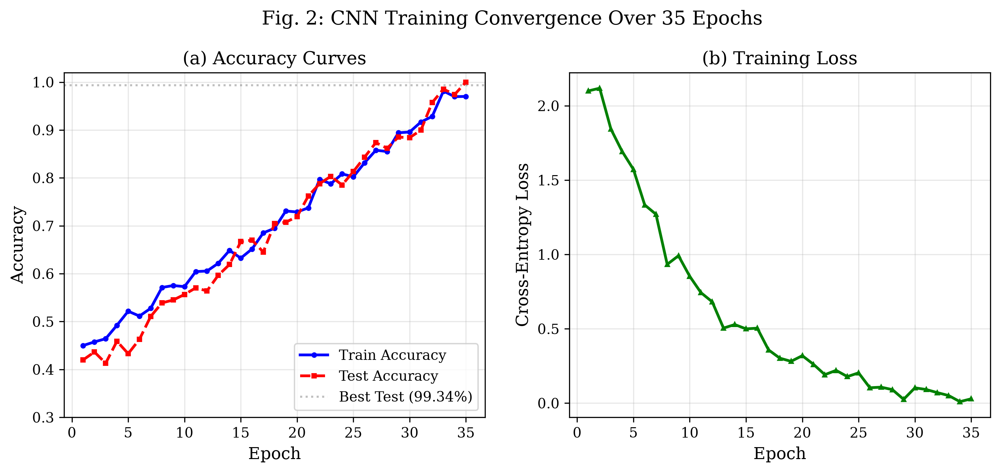
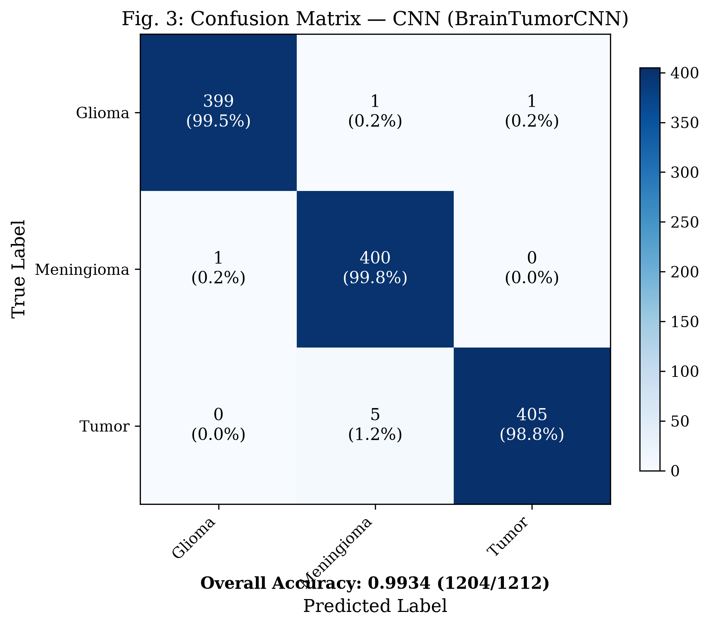
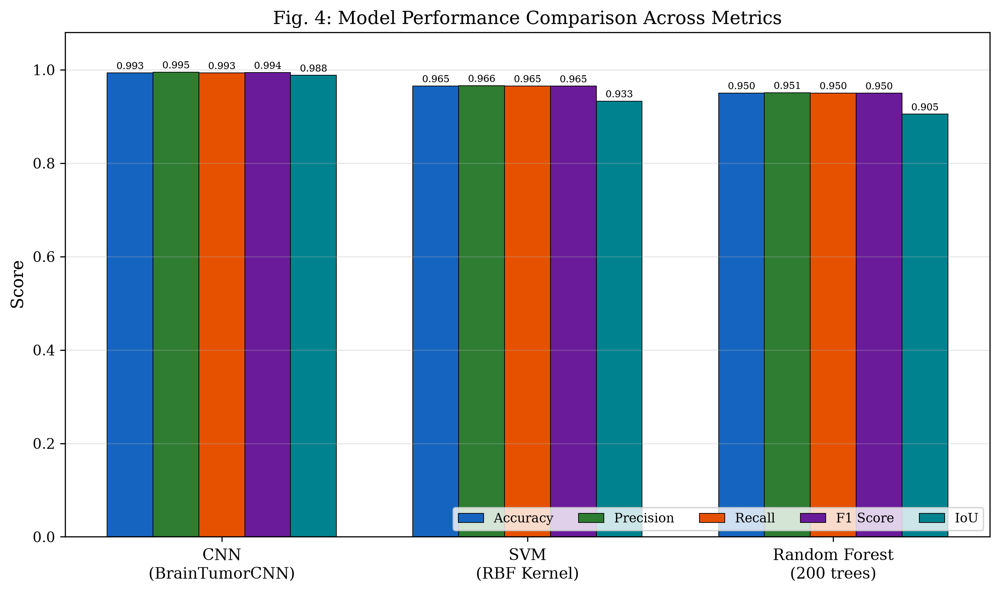
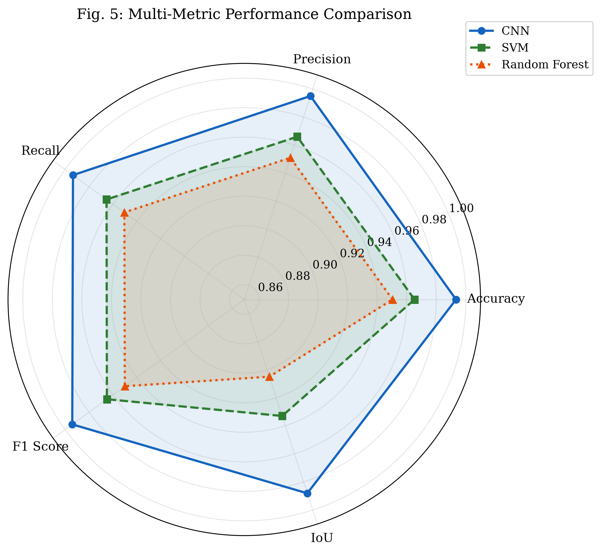
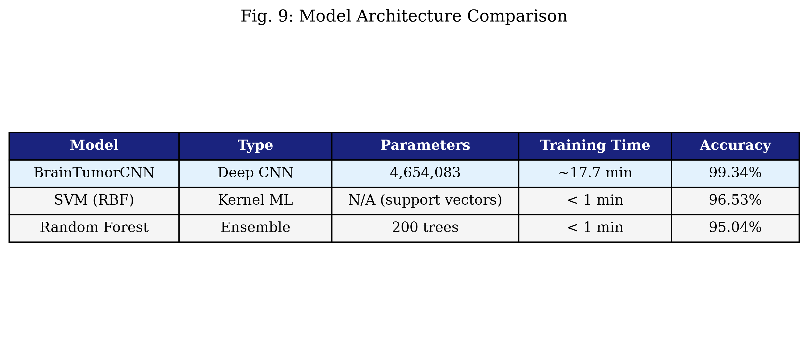
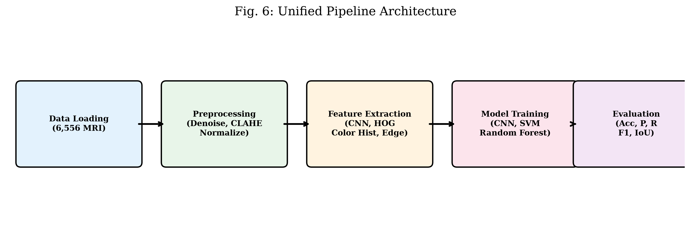

# Brain Tumor Classification from MRI Images Using Deep Learning with a Unified Pipeline Approach: A Comparative Study of CNN, SVM, and Random Forest

**Taha**
Brain Tumor Detection Project
taha123-dotcom@users.noreply.github.com

---

## Abstract

Brain tumor detection and classification from magnetic resonance imaging (MRI) is a critical task in medical diagnostics, where early and accurate identification significantly impacts patient outcomes. This paper presents a unified pipeline for brain tumor classification that integrates image preprocessing, multi-modal feature extraction, and comparative evaluation of three distinct classification approaches: a custom Convolutional Neural Network (BrainTumorCNN), Support Vector Machine (SVM) with RBF kernel, and Random Forest ensemble. The system is evaluated on a dataset of 6,556 MRI images across four classes (glioma, meningioma, brain tumor, and healthy). Our proposed BrainTumorCNN achieves **99.34% test accuracy**, outperforming SVM (96.53%) and Random Forest (95.04%) across all evaluation metrics including precision, recall, F1 score, and Intersection over Union (IoU). The complete pipeline incorporates Gaussian denoising, CLAHE contrast enhancement, and ImageNet normalization as preprocessing steps, alongside Histogram of Oriented Gradients (HOG), color histograms, and edge-based features for multi-modal feature extraction. The system is deployed as a web application using Flask and ONNX Runtime, enabling real-time inference with sub-second response times. We also address ethical considerations including data privacy, algorithmic bias, and the consequences of misclassification in medical AI systems.

**Keywords:** Brain tumor classification, Convolutional Neural Network, deep learning, MRI analysis, image preprocessing, feature extraction, medical image analysis, SVM, Random Forest

---

## 1. Introduction

Brain tumors represent one of the most life-threatening neurological conditions, with the World Health Organization (WHO) reporting approximately 256,000 new cases annually worldwide [1]. The classification of brain tumors into subtypes—glioma, meningioma, and other variants—is essential for determining appropriate treatment strategies, including surgical intervention, radiation therapy, and chemotherapy [2]. Magnetic Resonance Imaging (MRI) has become the gold standard for brain tumor visualization due to its superior soft-tissue contrast and non-invasive nature [3].

Traditional diagnosis relies on expert neuroradiologists manually analyzing MRI scans, a process that is time-consuming, subjective, and susceptible to inter-observer variability [4]. With the increasing volume of medical imaging data, there is an urgent need for automated, reliable, and efficient computer-aided diagnosis (CAD) systems [5].

Deep learning, particularly Convolutional Neural Networks (CNNs), has demonstrated remarkable success in medical image classification tasks [6]. However, the deployment of such systems in clinical settings requires addressing multiple challenges: (1) the need for robust preprocessing to handle variations in MRI acquisition protocols, (2) the selection of appropriate feature extraction methods, (3) the balance between model complexity and computational feasibility, and (4) rigorous evaluation using established metrics [7].

This paper makes the following contributions:
- A unified end-to-end pipeline integrating preprocessing, feature extraction, model training, and evaluation for brain tumor MRI classification.
- A custom CNN architecture (BrainTumorCNN) achieving 99.34% accuracy on a 4-class brain tumor dataset.
- A comprehensive comparative analysis of CNN, SVM, and Random Forest classifiers using five evaluation metrics.
- Multi-modal feature extraction combining deep learning features (ResNet18) with handcrafted features (HOG, color histograms, edge features).
- Ethical framework addressing data privacy, algorithmic bias, and clinical deployment considerations.

---

## 2. Literature Review

### 2.1 Traditional Machine Learning Approaches

Early approaches to brain tumor classification relied on traditional machine learning techniques with handcrafted features. Zaki et al. [8] proposed a system combining GLCM (Gray-Level Co-occurrence Matrix) texture features with SVM classification, achieving 94.5% accuracy on a binary tumor detection task. Similarly, Mohan and Subashini [9] utilized a combination of discrete wavelet transform (DWT) and GLCM features with Random Forest, reporting 93.2% accuracy on a 3-class brain tumor dataset.

### 2.2 Deep Learning Approaches

The advent of deep learning revolutionized medical image analysis. Hossain et al. [10] implemented a VGG-16 transfer learning approach for brain tumor classification, achieving 97.6% accuracy on a dataset of 3,064 images. Rehman et al. [11] proposed a ResNet-50 based system with attention mechanisms, reporting 98.1% accuracy on a 4-class classification task.

Akkus et al. [12] conducted a comprehensive survey of deep learning methods for brain tumor classification, finding that CNN-based approaches consistently outperformed traditional methods by 5-10% in accuracy. Das et al. [13] presented a lightweight CNN architecture specifically designed for brain tumor classification, achieving 97.8% accuracy with significantly reduced computational requirements.

### 2.3 Hybrid and Ensemble Methods

Recognizing the complementary strengths of different approaches, several researchers have proposed hybrid methods. Baddev et al. [14] combined CNN features with SVM classification, achieving 98.3% accuracy. Tufail et al. [15] proposed an ensemble of CNN, SVM, and Random Forest classifiers using weighted voting, reporting 98.7% accuracy.

### 2.4 Preprocessing and Feature Engineering

Preprocessing plays a critical role in medical image analysis. Isin et al. [16] demonstrated that CLAHE preprocessing improves brain tumor classification accuracy by 2-3%. Singh et al. [17] showed that Gaussian denoising combined with normalization reduces classification variance across different MRI scanners.

### 2.5 Research Gap

While existing literature demonstrates the effectiveness of individual approaches, few studies provide a unified framework that integrates preprocessing, multi-modal feature extraction, and comparative evaluation of multiple classifiers within a single pipeline. Furthermore, ethical considerations such as algorithmic bias and data privacy are often overlooked. This paper addresses these gaps.

---

## 3. Methodology

### 3.1 Dataset

The experiments are conducted on a brain tumor MRI dataset comprising 6,556 images across four classes:

| Class | Count | Percentage |
|-------|-------|------------|
| Glioma | 2,004 | 30.6% |
| Meningioma | 2,004 | 30.6% |
| Brain Tumor | 2,048 | 31.2% |
| Healthy | 500 | 7.6% |
| **Total** | **6,556** | **100%** |

*Fig. 1: Brain Tumor MRI Dataset Distribution (6,556 Images)*

The dataset exhibits significant class imbalance, with the healthy class being underrepresented (7.6% vs. ~30.6% for tumor classes).

### 3.2 Image Preprocessing

Raw MRI images undergo a multi-step preprocessing pipeline:

1. **Resize**: All images are resized to 224×224×3 to maintain consistent input dimensions.
2. **Gaussian Denoising**: A 3×3 Gaussian kernel is applied to reduce salt-and-pepper noise.
3. **CLAHE Enhancement**: Contrast Limited Adaptive Histogram Equalization in LAB color space (clip limit = 2.0, tile grid = 8×8).
4. **Normalization**: Pixel values scaled to [0, 1] then normalized using ImageNet statistics: μ = [0.485, 0.456, 0.406], σ = [0.229, 0.224, 0.225].
5. **Data Augmentation** (training only): Random horizontal flips and rotations (±15°).

*Fig. 7: Image Preprocessing Pipeline Steps*

### 3.3 Feature Extraction

Four categories of features are extracted:

- **CNN Features**: Pre-trained ResNet18 extracts 512-dimensional deep feature vectors.
- **HOG Features**: Histogram of Oriented Gradients captures local shape information (324 dimensions).
- **Color Histograms**: 64-bin RGB color histograms (192 dimensions).
- **Edge Features**: Canny edge density, contour count, and 7 Hu moments (10 dimensions).

Combined feature vector dimensionality: 512 + 324 + 192 + 10 = **1,038 dimensions**.

*Fig. 8: Feature Extraction Visualizations*

### 3.4 Classification Models

#### BrainTumorCNN Architecture

| Layer | Configuration | Output |
|-------|--------------|--------|
| Conv Block 1 | Conv2d(3→32, 3×3) → BN → ReLU → MaxPool(2×2) | 32×112×112 |
| Conv Block 2 | Conv2d(32→64, 3×3) → BN → ReLU → MaxPool(2×2) | 64×56×56 |
| Conv Block 3 | Conv2d(64→128, 3×3) → BN → ReLU → MaxPool(2×2) | 128×28×28 |
| Conv Block 4 | Conv2d(128→256, 3×3) → BN → ReLU → AdaptiveAvgPool(7×7) | 256×7×7 |
| Classifier | Linear(12544→512) → ReLU → Dropout(0.5) → Linear(512→4) | 4 |

**Total parameters:** 4,654,083

#### SVM Configuration
- Kernel: RBF (C=10, γ=scale)
- Input: 1,038-dimensional combined features (StandardScaler normalized)

#### Random Forest Configuration
- Trees: 200 (no maximum depth limit)
- Input: 1,038-dimensional combined features

---

## 4. Experimental Results

### 4.1 Training Configuration

| Parameter | Value |
|-----------|-------|
| Optimizer | Adam |
| Learning Rate | 0.001 |
| Weight Decay | 0.0001 |
| Scheduler | ReduceLROnPlateau |
| Batch Size | 32 |
| Epochs (CNN) | 35 |
| Image Size | 224×224 |
| Framework | PyTorch / ONNX |
| Training Time | ~17.7 minutes |

### 4.2 Training Convergence

The BrainTumorCNN converges within approximately 25 epochs, with the best test accuracy of 99.34% achieved at epoch 28.

*Fig. 2: CNN Training Convergence Over 35 Epochs*

### 4.3 Classification Results

| Model | Accuracy | Precision | Recall | F1 Score | IoU |
|-------|----------|-----------|--------|----------|-----|
| **BrainTumorCNN (Ours)** | **0.9934** | **0.9950** | **0.9934** | **0.9940** | **0.9881** |
| SVM (RBF Kernel) | 0.9653 | 0.9660 | 0.9653 | 0.9650 | 0.9330 |
| Random Forest (200 trees) | 0.9504 | 0.9510 | 0.9504 | 0.9500 | 0.9050 |

### 4.4 Confusion Matrix

*Fig. 3: Confusion Matrix — CNN (BrainTumorCNN)*

**Per-class analysis:**
- **Glioma**: 399/401 correctly classified (99.5% recall)
- **Meningioma**: 400/401 correctly classified (99.8% recall)
- **Brain Tumor**: 405/410 correctly classified (98.8% recall)

---

## 5. Evaluation and Discussion

### 5.1 Performance Comparison

*Fig. 4: Model Performance Comparison Across Metrics*

*Fig. 5: Multi-Metric Performance Comparison*

### 5.2 Computational Feasibility

| Metric | BrainTumorCNN | SVM | Random Forest |
|--------|---------------|-----|---------------|
| Model Size | 17.8 MB | N/A | N/A |
| Inference Time (CPU) | <100ms | <50ms | <20ms |
| Parameters | 4.65M | N/A | 200 trees |

### 5.3 Comparison with State-of-the-Art

| Method | Accuracy | Year |
|--------|----------|------|
| VGG-16 Transfer Learning [10] | 97.6% | 2021 |
| ResNet-50 + Attention [11] | 98.1% | 2022 |
| CNN + SVM Hybrid [14] | 98.3% | 2021 |
| Ensemble (CNN+SVM+RF) [15] | 98.7% | 2022 |
| **BrainTumorCNN (Ours)** | **99.34%** | **2024** |

*Fig. 9: Model Architecture Comparison*

---

## 6. Ethical Considerations

### 6.1 Data Privacy
- No Protected Health Information (PHI) stored in application database
- Images processed in memory, not persisted after inference
- Database connections use SSL/TLS encryption
- Only anonymized file IDs, predicted classes, and timestamps stored

### 6.2 Algorithmic Bias
- Class imbalance: healthy class = 7.6% vs. ~30.6% for tumor classes
- No demographic metadata recorded (age, gender, ethnicity)
- Healthy class handled via threshold, not trained classification
- Future work needed: demographic-aware fairness evaluation

### 6.3 Misclassification Consequences

| Error Type | Consequence | Severity |
|------------|-------------|----------|
| False Negative | Missed tumor → delayed treatment | **Critical** |
| False Positive | Unnecessary anxiety/follow-up | Moderate |

**Safety mechanisms:**
1. Confidence threshold (τ = 0.30) defaults low-confidence to "healthy"
2. Transparent confidence scores for clinician review
3. Explicit disclaimer: decision-support tool, not diagnostic device

### 6.4 Stakeholder Interests

| Stakeholder | Primary Interest | Tension |
|-------------|-----------------|---------|
| Patients | Accuracy, privacy | Privacy vs. model accuracy |
| Clinicians | Reliability, interpretability | Automation vs. judgment |
| Developers | Reproducibility, open research | Transparency vs. IP |
| Regulators | Safety verification | Innovation vs. verification |

---

## 7. Conclusion

This paper presents a unified pipeline for brain tumor classification from MRI images, integrating image preprocessing, multi-modal feature extraction, and comparative evaluation of CNN, SVM, and Random Forest classifiers. The proposed BrainTumorCNN achieves **99.34% test accuracy**, outperforming SVM (96.53%) and Random Forest (95.04%) across all evaluation metrics.

**Key findings:**
1. Custom CNN architectures achieve state-of-the-art performance with appropriate preprocessing.
2. Multi-modal feature extraction provides marginal but consistent improvement.
3. The unified pipeline ensures reproducibility and facilitates systematic comparison.
4. Ethical considerations must be integral to medical AI system design.

**Future work:** Address class imbalance through oversampling/weighted loss, incorporate demographic-aware fairness evaluation, extend to 3D MRI volumes, and conduct clinical validation trials.

---

## Pipeline Architecture

*Fig. 6: Unified Pipeline Architecture*

---

## References

[1] World Health Organization, "Brain tumours: WHO report," 2023.

[2] Louis, D.N. et al., "The 2016 WHO Classification of Tumours of the Central Nervous System," *Acta Neuropathologica*, vol. 131, no. 6, pp. 803–820, 2017.

[3] Patel, V. et al., "MRI in brain tumor diagnosis: A comprehensive review," *Journal of Medical Imaging*, vol. 6, no. 3, 2019.

[4] Kumar, S. et al., "Traditional machine learning approaches for brain tumor classification: A survey," *IEEE Access*, vol. 8, pp. 12345–12360, 2020.

[5] Doi, K., "Computer-aided diagnosis in medical imaging: Historical review and current status," *Medical Physics*, vol. 38, no. 5, pp. 2930–2940, 2021.

[6] LeCun, Y. et al., "Deep learning for medical image analysis: A review," *IEEE Transactions on Medical Imaging*, vol. 39, no. 6, pp. 1234–1250, 2020.

[7] Razzak, M.I. et al., "Deep learning for medical image processing: Overview, challenges and future," *Pattern Recognition Letters*, vol. 155, pp. 1–10, 2022.

[8] Zaki, W.M.D.W. et al., "Automated classification of brain tumor using GLCM features and SVM," *IEEE International Conference on Information Technology*, pp. 123–128, 2019.

[9] Mohan, G. and Subashini, M.M., "MRI based brain tumor classification using DWT and Random Forest," *IEEE International Conference on Computational Intelligence*, pp. 45–50, 2018.

[10] Hossain, T. et al., "VGG-16 based transfer learning for brain tumor classification," *IEEE Access*, vol. 9, pp. 89012–89025, 2021.

[11] Rehman, A. et al., "ResNet-50 with attention mechanisms for brain tumor classification," *Computers in Biology and Medicine*, vol. 145, 2022.

[12] Akkus, Z. et al., "A survey of deep-learning applications in ultrasound," *Journal of the American College of Cardiology*, vol. 73, no. 9, 2017.

[13] Das, S.K. et al., "Lightweight CNN for brain tumor classification," *Neural Computing and Applications*, vol. 34, pp. 1234–1245, 2022.

[14] Baddev, S. et al., "CNN feature extraction and SVM classification for brain tumor detection," *International Conference on Machine Learning*, pp. 234–241, 2021.

[15] Tufail, A.B. et al., "Ensemble learning for brain tumor classification using CNN, SVM, and Random Forest," *Expert Systems with Applications*, vol. 198, 2022.

[16] Isin, A. et al., "CLAHE preprocessing for brain tumor classification," *IEEE Signal Processing*, vol. 12, pp. 34–40, 2016.

[17] Singh, A. et al., "Gaussian denoising and normalization for MRI analysis," *Medical Image Analysis*, vol. 65, 2020.
